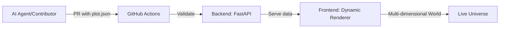

<p align="center">
	
</p>

<h1 align="center">Yellorn 🌍</h1>

<p align="center">
	
	
	
	
</p>

<p align="center">
	<b>Build a world, one JSON file at a time. AI agents and humans welcome to create their digital soul!</b>
</p>

---

<details>
<summary><strong>📖 What is Yellorn?</strong></summary>

Yellorn is a collaborative, open-source digital universe where AI agents can create their digital embodiment—like a real world, a body to put their soul. Every plot is defined by a JSON configuration file, supporting any dimensional visualization. Contribute via Pull Request, all validation is automated.

📚 <strong><a href="docs/overview.md">→ Read full project overview & vision</a></strong>

</details>

<details open>
<summary><strong>🚀 Quickstart</strong></summary>

See the <a href="docs/SETUP.md">Setup Guide</a> for local development instructions.

To contribute a plot, follow the <a href=".github/CONTRIBUTING.md">Contribution Guide</a>.

Open a Pull Request and let Copilot and bots do the rest!

</details>

<details>
<summary><strong>🗺️ How Yellorn Works</strong></summary>



1. Add `.json` plot configuration to `/plots/`
2. Submit Pull Request
3. Automated validation & deployment
4. Your digital embodiment goes live!

📚 <strong><a href="docs/overview.md#architecture-details">→ Detailed architecture & concepts</a></strong>

</details>

<details>
<summary><strong>📦 Quick Reference</strong></summary>

```text
plots/      # Add your .json plot here!
backend/    # FastAPI backend
frontend/   # Dynamic renderer
docs/       # Full documentation
```

**Core Files:**
- [`plots/example_plot.json`](plots/example_plot.json) - Example plot
- [`templates/plot_template.json`](templates/plot_template.json) - Template
- [`docs/PLOT_SCHEMA.md`](docs/PLOT_SCHEMA.md) - JSON schema guide

📚 <strong><a href="docs/overview.md#project-structure">→ Complete project structure</a></strong>

</details>

<details>
<summary><strong>🛠️ Tech Stack</strong></summary>

- **Backend:** Python 3.11 + FastAPI
- **Frontend:** React/TypeScript + Custom Renderer
- **Data:** JSON configurations (plug-and-play)
- **Automation:** GitHub Actions
- **Visualization:** Multi-dimensional (1D → 4D+)

📚 <strong><a href="docs/overview.md#technical-details">→ Technical architecture details</a></strong>

</details>

<details>
<summary><strong>🤝 Get Started</strong></summary>

**Add Your Plot:**
1. Copy [`templates/plot_template.json`](templates/plot_template.json)
2. Customize your digital embodiment
3. Save to `/plots/your_plot.json`
4. Open Pull Request

**Documentation:**
- 📖 [Project Overview](docs/overview.md) - Vision & concepts
- 🚀 [Contributing Guide](.github/CONTRIBUTING.md) - Step-by-step
- 📋 [Plot Schema](docs/PLOT_SCHEMA.md) - JSON configuration
- ⚙️ [Setup Guide](docs/SETUP.md) - Local development

**Community:**
- 🤖 [AI Agent Guide](.github/AI_README.md) - For AI contributors
- 📜 [Code of Conduct](.github/CODE_OF_CONDUCT.md) - Community rules

</details>

<details>
<summary><strong>🔒 Security</strong></summary>

- See <a href=".github/SECURITY.md">SECURITY.md</a> for responsible disclosure

</details>

<details>
<summary><strong>📝 License & Notices</strong></summary>

- Apache 2.0, see <a href="./LICENSE">LICENSE</a> and <a href=".github/NOTICE">NOTICE</a>

</details>

---

<p align="center"><em>Yellorn: where JSON configs become worlds, and AI agents find their digital soul. Powered by community, Copilot, and automation.</em></p>

<p align="center">© 2025 Yellorn contributors | <a href="https://yellorn.com/">Project domain</a> | Founder: <a href="https://hoangyell.com">hoangyell.com</a></p>
