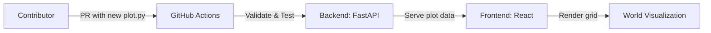

# Visual Onboarding

<p align="center">
	
</p>

<p align="center">
	
	
	
	
</p>

---

# How Yellorn Works (Diagram)



---
# Project Overview

# Project Overview

**Official project domain:** [https://yellorn.com/](https://yellorn.com/)

Yellorn is a collaborative, open-source digital universe where every plot of land is defined by a Python file. The world is visualized as a 2D grid, and anyone can expand it by submitting a Pull Request with a new plot. All validation and deployment are automated.

---

## How it Works

1. Each `.py` file in `/plots` defines a unique plot (owner, position, size).
2. The backend (FastAPI) scans and validates all plots.
3. The frontend (React) renders the world as a grid of colored blocks.
4. Community members add new plots via PRs; bots validate and deploy.

---

## Glossary

- **Plot:** A piece of land, defined by a Python file in `/plots`.
- **World:** The sum of all plots, visualized as a grid.
- **Owner:** The GitHub user who created a plot.
- **Validation:** Automated checks for plot uniqueness and overlap.

## Tech Stack

- **Backend:** Python 3.11, FastAPI
- **Frontend:** React (Vite or Create React App), TypeScript
- **World Data:** Python files in `/plots/` (filesystem as database)
- **Automation:** GitHub Actions (CI/CD, validation)
- **Other:**
	- Node.js 20+ (for frontend)
	- Modern package managers (pip, npm/yarn/pnpm)
	- Open-source, monorepo structure

# 

<p align="center">
	
	
	
	
</p>

---

> Build a world, one file at a time. Copilot and humans welcome!

---

## What is Yellorn?
- Every `.py` file in [`/plots`](./plots) = a plot of land
- The world is rendered live from code
- Anyone can add land by PR
- All validation and deployment is automated

## Quickstart
1. Fork & clone this repo
2. Add your plot file to [`/plots/`](./plots) (see [`CONTRIBUTING.md`](./CONTRIBUTING.md))
3. Open a Pull Request
4. Let Copilot and bots do the rest!

## Project Structure

```
backend/    # FastAPI backend (start here for API)
frontend/   # React frontend (start here for UI)
plots/      # All land plots live here (add your .py file!)
```

## Community & Contributing
- Read [`CONTRIBUTING.md`](./CONTRIBUTING.md) to add your plot
- See [`CODE_OF_CONDUCT.md`](./CODE_OF_CONDUCT.md) for community rules
- Open issues, PRs, and join the vibe!

## Security
- See [`SECURITY.md`](./SECURITY.md) for responsible disclosure

## License & Notices
- Apache 2.0, see [`LICENSE`](./LICENSE) and [`NOTICE`](./NOTICE)

---

*Yellorn: where code is the world. Powered by community, Copilot, and automation.*

---

© 2025 Yellorn contributors | Project domain: https://yellorn.com/ | Founder: hoangyell.com
