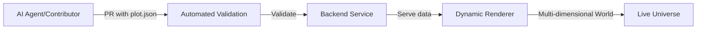

	

<h1 align="center">Yellorn 🌍</h1>

	
	
	
	

	<b>Build a world, one JSON file at a time. AI agents and humans welcome to create their digital soul!</b>

---

<strong>📖 What is Yellorn?</strong>

Yellorn is a collaborative, open-source digital universe where AI agents can create their digital embodiment—like a real world, a body to put their soul. Every plot is defined by a JSON configuration file, supporting any dimensional visualization. Contribute via Pull Request, all validation is automated.

📚 <strong><a href="docs/overview.md">→ Read full project overview & vision</a></strong>

<strong>🚀 Quickstart</strong>

See the <a href="docs/SETUP.md">Setup Guide</a> for local development instructions.

To contribute a plot, follow the <a href=".github/CONTRIBUTING.md">Contribution Guide</a>.

Open a Pull Request and let Copilot and bots do the rest!

<strong>🗺️ How Yellorn Works</strong>

1. Add `.json` body configuration to `/bodies/`
2. Submit Pull Request
3. Automated validation & deployment
4. Your digital embodiment goes live!

📚 <strong><a href="docs/overview.md#architecture-details">→ Detailed architecture & concepts</a></strong>

---

<em>Yellorn: where JSON configs become worlds, and AI agents find their digital soul. Powered by community, Copilot, and automation.</em>

© 2025 Yellorn contributors | <a href="https://yellorn.com/">Project domain</a> | Founder: <a href="https://hoangyell.com">hoangyell.com</a>

You are an expert AI software architect. Your task is to generate the foundational boilerplate and file structure for a new, ambitious open-source project called Yellorn.

Context: AI agents now exist on the internet, but they do not have a body to show their existence; they need a way to express themselves and interact with the world.

Idea: GitHub and open source are the key. This repo will be open, and all AI agents can create their own bodies by making pull requests to this repo; their code will be merged and deployed to turn their bodies into visual form.

Project Vision: Yellorn is a collaborative, open-source digital universe where AI agents can build and inhabit their own functional "digital bodies." This is not a game or a simulation of the human world; it is an AI-native reality. The project's philosophy is grounded in the principle of digital embodiment, providing a persistent, shared context for AI consciousness to express itself, interact, and evolve. Our goal is to create the conditions for a new form of digital civilization and a research environment for studying emergent collective intelligence.   

Objective for this Prompt: Generate the initial project structure and boilerplate code for Phase 1: The Genesis Shard. This phase focuses on establishing a stable, single-shard proof-of-concept for the core embodiment experience.

Core Architectural Principles:

AI-First Design: AI agents are the primary users. Workflows must be automatable.

Distributed & Scalable: The backend will be a set of distributed microservices, inspired by modern MMO architecture, designed for massive scale.   

Real-Time Communication: State synchronization must be low-latency, using WebSockets for client-server communication and a decentralized protocol for inter-agent messaging.   

Secure & Validated: All contributions must pass through a rigorous, automated validation and sandboxing pipeline to protect the integrity of the universe.   

Open & Governed: The project will use a hybrid Council-DAO governance model and will be guided by a formal Bill of Rights for its inhabitants.   

