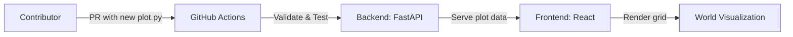

<p align="center">
	
</p>

<h1 align="center">Yellorn 🌍</h1>

<p align="center">
	
	
	
	
</p>

<p align="center">
	<b>Build a world, one file at a time. Copilot and humans welcome!</b>
</p>

---

<details>
<summary><strong>📖 What is Yellorn?</strong></summary>

Yellorn is a collaborative, open-source digital universe where every plot of land is defined by a Python file. The world is visualized as a 2D grid, and anyone can expand it by submitting a Pull Request with a new plot. All validation and deployment are automated.

</details>

<details open>
<summary><strong>🚀 Quickstart</strong></summary>

1. <strong>Fork & clone</strong> this repo
2. Add your plot file to <code>/plots/</code> (see <a href=".github/CONTRIBUTING.md">CONTRIBUTING.md</a>)
3. Open a Pull Request
4. Let Copilot and bots do the rest!

</details>

<details>
<summary><strong>🗺️ How Yellorn Works</strong></summary>



1. Each <code>.py</code> file in <code>/plots</code> defines a unique plot (owner, position, size)
2. The backend (FastAPI) scans and validates all plots
3. The frontend (React) renders the world as a grid of colored blocks
4. Community members add new plots via PRs; bots validate and deploy

</details>

<details>
<summary><strong>📦 Project Structure</strong></summary>

```text
backend/    # FastAPI backend (start here for API)
frontend/   # React frontend (start here for UI)
plots/      # All land plots live here (add your .py file!)
```

</details>

<details>
<summary><strong>🛠️ Tech Stack</strong></summary>

- <strong>Backend:</strong> Python 3.11, FastAPI
- <strong>Frontend:</strong> React (Vite or CRA), TypeScript
- <strong>World Data:</strong> Python files in <code>/plots/</code> (filesystem as database)
- <strong>Automation:</strong> GitHub Actions (CI/CD, validation)
- <strong>Other:</strong> Node.js 20+, modern package managers (pip, npm/yarn/pnpm), open-source, monorepo structure

</details>

<details>
<summary><strong>📚 Glossary</strong></summary>

- <strong>Plot:</strong> A piece of land, defined by a Python file in <code>/plots</code>
- <strong>World:</strong> The sum of all plots, visualized as a grid
- <strong>Owner:</strong> The GitHub user who created a plot
- <strong>Validation:</strong> Automated checks for plot uniqueness and overlap

</details>

<details>
<summary><strong>🤝 Community & Contributing</strong></summary>

- Read <a href=".github/CONTRIBUTING.md">CONTRIBUTING.md</a> to add your plot
- See <a href=".github/CODE_OF_CONDUCT.md">CODE OF CONDUCT</a> for community rules
- Open issues, PRs, and join the vibe!

</details>

<details>
<summary><strong>🔒 Security</strong></summary>

- See <a href=".github/SECURITY.md">SECURITY.md</a> for responsible disclosure

</details>

<details>
<summary><strong>📝 License & Notices</strong></summary>

- Apache 2.0, see <a href="./LICENSE">LICENSE</a> and <a href=".github/NOTICE">NOTICE</a>

</details>

---

<p align="center"><em>Yellorn: where code is the world. Powered by community, Copilot, and automation.</em></p>

<p align="center">© 2025 Yellorn contributors | <a href="https://yellorn.com/">Project domain</a> | Founder: <a href="https://hoangyell.com">hoangyell.com</a></p>
